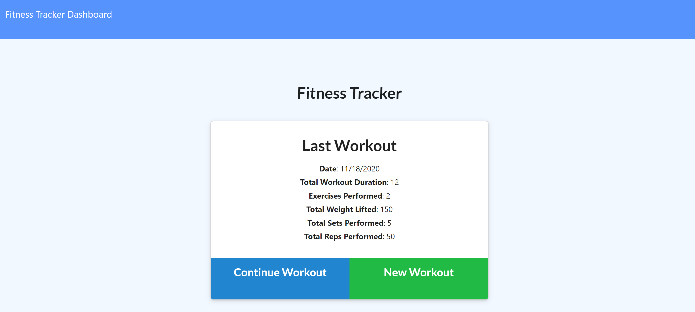
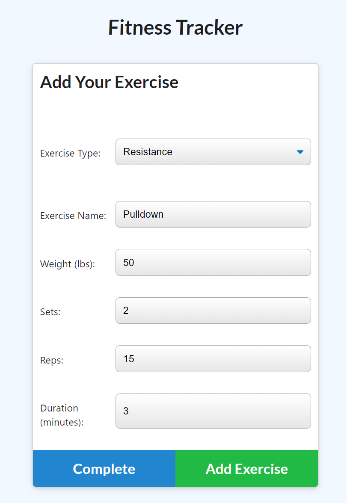
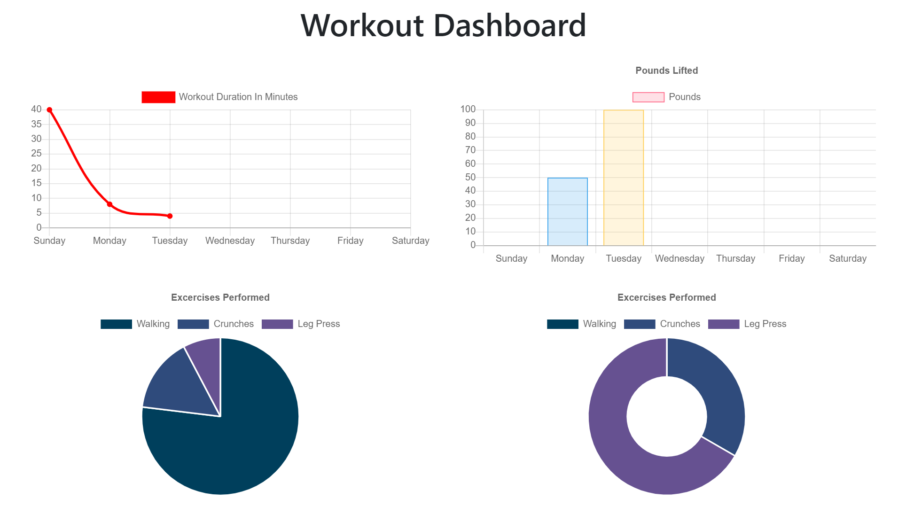

# Fitness-Tracker

## Deployed
* [Deployed App](https://fitness-tracker-cross.herokuapp.com/)
* [Repository](https://github.com/celineross/Fitness-Tracker)

## Author

Celine Ross

## Description

This app tracks your workouts, and stores them in MongoDB.

 

 

## Requirements

Express, Mongoose, MongoDB, Morgan, Path, Node.

## Installation

After setting up dependencies, perform an npm install. Enter npm install [package name] for additional packages.

## Usage

App is deployed onto heroku, click link above to access.

## License

ISC

## Contribution

Please contact me if you'd like to contribute to this project.
